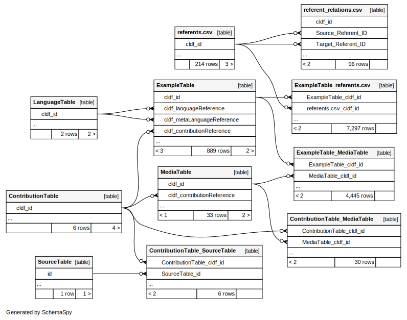

**Multi-CAST**, the *Multilingual Corpus of Annotated Spoken Texts*, is a collection of annotated texts from a typologically diverse section of languages.

Each corpus provides

- multiple levels of parallel annotations, time-aligned with audio recordings,
- including comparative morphosyntactic annotations for cross-corpus typological research
- chiefly monologic, natural narrative texts

The annotation data of each corpus is available in multiple file formats, including as EAF files for the linguistic annotation software ELAN, as XML and TSV files, and via the multicastR package for R.

Each corpus is also available as [CLDF TextCorpus](https://cldf.clld.org), with the CLDF tables related as shown here

Corpora are freely accessible under a CC-BY 4.0 licence.
